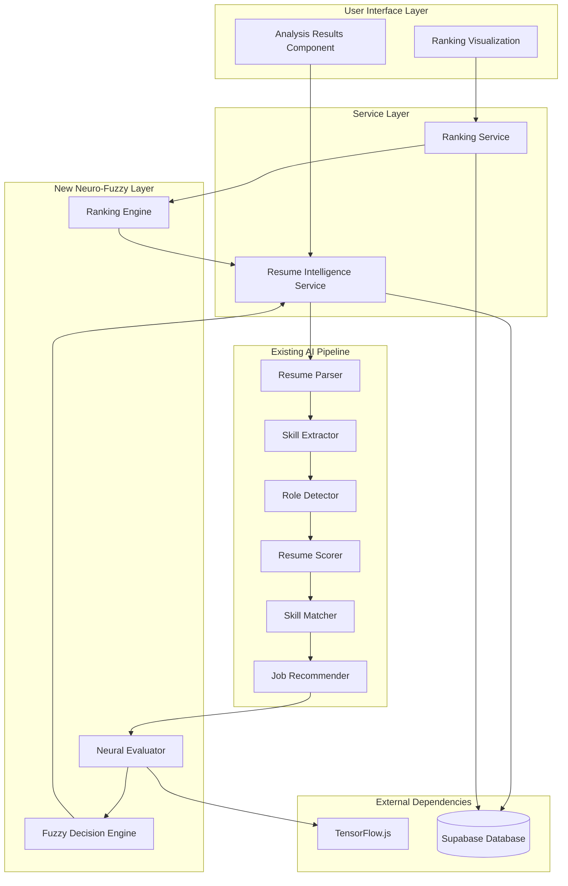

# Design Document: Neuro-Fuzzy Resume Ranking System

## Overview

The Neuro-Fuzzy Resume Ranking System extends the existing AI Resume Intelligence Platform with advanced soft computing techniques. This enhancement introduces three new AI modules: a neural network evaluator using TensorFlow.js, a fuzzy logic decision engine, and a multi-resume ranking engine. These components work together to provide data-driven resume quality assessment, human-interpretable qualitative ratings, and automated candidate ranking capabilities.

### Key Design Goals

1. **Non-Breaking Integration**: All new features integrate seamlessly with the existing pipeline without disrupting current functionality
2. **Graceful Degradation**: System continues operating with existing features if new modules fail
3. **Performance Efficiency**: Neural and fuzzy evaluations complete within strict time constraints
4. **Type Safety**: Strong TypeScript typing throughout all new modules
5. **Scalability**: Support for batch processing of up to 50 resumes with parallel execution
6. **User Experience**: Clear visualization of neural scores, fuzzy ratings, and candidate rankings

### Integration Strategy

The neuro-fuzzy system operates as an enhancement layer on top of the existing pipeline:

```
Existing Pipeline → Neural Evaluator → Fuzzy Engine → Enhanced Results
                                                    ↓
Multiple Resumes → Existing Pipeline (each) → Ranking Engine → Ranked List
```

All existing functionality (parsing, skill extraction, scoring, job recommendations) remains unchanged. New modules receive data from the existing pipeline and augment results with additional insights.

## Architecture

### System Architecture Diagram



### Component Responsibilities

#### Neural Resume Evaluator
- Loads and manages TensorFlow.js neural network model
- Extracts six input features from resume analysis results
- Normalizes features to [0,1] range
- Performs forward pass through neural network
- Scales output from [0,1] to [0,100] for neural score
- Handles errors gracefully with fallback behavior

#### Fuzzy Decision Engine
- Defines fuzzy membership functions for skill match, experience, and quality
- Implements fuzzy rule base (9+ rules)
- Performs fuzzification of crisp inputs
- Applies fuzzy inference rules
- Defuzzifies results to produce qualitative ratings
- Generates hiring recommendations based on fuzzy outputs

#### Ranking Engine
- Orchestrates batch processing of multiple resumes
- Invokes existing pipeline for each resume
- Collects neural scores and fuzzy ratings
- Calculates weighted final scores
- Sorts candidates by final score
- Assigns ranks and formats results

#### Resume Intelligence Service (Enhanced)
- Maintains all existing orchestration logic
- Invokes neural evaluator after existing pipeline
- Invokes fuzzy engine with combined data
- Merges new fields with existing results
- Implements graceful fallback for module failures
- Stores enhanced results to database

## Components and Interfaces

### Neural Resume Evaluator

**File**: `src/ai/neuro/neuralResumeEvaluator.ts`

#### Neural Network Architecture

```
Input Layer (6 neurons)
    ↓
Hidden Layer 1 (16 neurons, ReLU activation)
    ↓
Hidden Layer 2 (8 neurons, ReLU activation)
    ↓
Output Layer (1 neuron, Sigmoid activation)
    ↓
Scale [0,1] → [0,100]
```

**Architecture Rationale**:
- 6 input features capture key resume quality dimensions
- 16 neurons in first hidden layer provide sufficient capacity for feature interactions
- 8 neurons in second hidden layer compress representations
- ReLU activation prevents vanishing gradients
- Sigmoid output naturally bounds predictions to [0,1]
- Two hidden layers balance expressiveness with overfitting risk

#### Input Features

1. **skillMatchScore** (0-100): Percentage match from skill matcher
2. **experienceYears** (0-20+): Years of professional experience
3. **projectsCount** (0-20+): Number of projects mentioned
4. **educationScore** (0-100): Quality score of education section
5. **keywordDensity** (0-1): Ratio of relevant keywords to total words
6. **sectionCompleteness** (0-1): Fraction of expected sections present

#### Feature Normalization

```typescript
normalized = {
  skillMatchScore: skillMatchScore / 100,
  experienceYears: Math.min(experienceYears, 20) / 20,
  projectsCount: Math.min(projectsCount, 20) / 20,
  educationScore: educationScore / 100,
  keywordDensity: keywordDensity, // already [0,1]
  sectionCompleteness: sectionCompleteness // already [0,1]
}
```

#### TypeScript Interfaces

```typescript
interface NeuralInputFeatures {
  skillMatchScore: number;      // 0-100
  experienceYears: number;       // 0-20+
  projectsCount: number;         // 0-20+
  educationScore: number;        // 0-100
  keywordDensity: number;        // 0-1
  sectionCompleteness: number;   // 0-1
}

interface NeuralEvaluationResult {
  success: boolean;
  neuralScore: number | null;    // 0-100 or null if failed
  error?: string;
  processingTimeMs: number;
}
```

#### Public API

```typescript
/**
 * Evaluates resume quality using a neural network model
 * @param features - Normalized input features extracted from resume analysis
 * @returns Neural evaluation result with score 0-100
 */
export async function evaluateResume(
  features: NeuralInputFeatures
): Promise<NeuralEvaluationResult>

/**
 * Initializes the TensorFlow.js model (lazy loading)
 * @returns Promise that resolves when model is ready
 */
export async function initializeModel(): Promise<void>

/**
 * Checks if the neural evaluator is available
 * @returns true if TensorFlow.js loaded successfully
 */
export function isAvailable(): boolean
```

#### Error Handling

- TensorFlow.js load failure: Return `{ success: false, neuralScore: null, error: "TensorFlow.js unavailable" }`
- Invalid input features: Use default value 0 for missing features, log warning
- Inference exception: Catch, log, return error result
- Model initialization failure: Set availability flag to false, all subsequent calls return unavailable error

### Fuzzy Decision Engine

**File**: `src/ai/fuzzy/fuzzyDecisionEngine.ts`

#### Fuzzy Variables and Membership Functions

**Skill Match Score (0-100)**
- Low: Trapezoidal [0, 0, 30, 50]
- Medium: Triangular [30, 50, 70]
- High: Trapezoidal [50, 70, 100, 100]

**Experience Years (0-20+)**
- Junior: Trapezoidal [0, 0, 1, 3]
- Mid: Triangular [2, 4, 6]
- Senior: Trapezoidal [5, 7, 20, 20]

**Neural Score (0-100)**
- Poor: Trapezoidal [0, 0, 40, 55]
- Average: Triangular [40, 55, 70]
- Good: Triangular [55, 70, 85]
- Excellent: Trapezoidal [70, 85, 100, 100]

**Resume Quality (Output)**
- Poor: 25
- Average: 50
- Good: 75
- Excellent: 95

#### Fuzzy Rule Base

```
Rule 1: IF skill_match is High AND experience is Senior THEN quality is Excellent
Rule 2: IF skill_match is High AND experience is Mid THEN quality is Good
Rule 3: IF skill_match is High AND experience is Junior THEN quality is Good
Rule 4: IF skill_match is Medium AND experience is Senior THEN quality is Good
Rule 5: IF skill_match is Medium AND experience is Mid THEN quality is Average
Rule 6: IF skill_match is Medium AND experience is Junior THEN quality is Average
Rule 7: IF skill_match is Low AND experience is Senior THEN quality is Average
Rule 8: IF skill_match is Low AND experience is Mid THEN quality is Poor
Rule 9: IF skill_match is Low AND experience is Junior THEN quality is Poor
Rule 10: IF neural_score is Excellent THEN quality is Excellent (override)
Rule 11: IF neural_score is Poor THEN quality is Poor (override)
```

#### Defuzzification

Uses weighted average method:
```
defuzzified_value = Σ(rule_strength_i × output_value_i) / Σ(rule_strength_i)
```

#### Hiring Recommendation Logic

```typescript
if (defuzzified_value >= 80) return "Strong Candidate"
else if (defuzzified_value >= 55) return "Consider"
else return "Reject"
```

#### TypeScript Interfaces

```typescript
type FuzzyRating = "Poor" | "Average" | "Good" | "Excellent";
type HiringRecommendation = "Reject" | "Consider" | "Strong Candidate";

interface FuzzyInputs {
  neuralScore: number;        // 0-100
  skillMatchScore: number;    // 0-100
  experienceYears: number;    // 0-20+
}

interface FuzzyDecisionResult {
  success: boolean;
  fuzzyRating: FuzzyRating | null;
  hiringRecommendation: HiringRecommendation | null;
  confidence: number;         // 0-1, based on rule strengths
  error?: string;
  processingTimeMs: number;
}

interface MembershipFunction {
  type: 'triangular' | 'trapezoidal';
  points: number[];
}

interface FuzzyVariable {
  name: string;
  range: [number, number];
  terms: Map<string, MembershipFunction>;
}
```

#### Public API

```typescript
/**
 * Makes fuzzy logic decision on resume quality
 * @param inputs - Neural score, skill match score, and experience years
 * @returns Fuzzy rating and hiring recommendation
 */
export function makeFuzzyDecision(
  inputs: FuzzyInputs
): FuzzyDecisionResult

/**
 * Calculates membership degree for a value in a fuzzy set
 * @param value - Crisp input value
 * @param membershipFn - Membership function definition
 * @returns Membership degree [0,1]
 */
export function calculateMembership(
  value: number,
  membershipFn: MembershipFunction
): number
```

#### Error Handling

- Invalid input ranges: Clamp to valid ranges, log warning
- Missing inputs: Use defaults (neuralScore=50, skillMatchScore=50, experienceYears=2)
- Defuzzification failure: Return "Average" rating and "Consider" recommendation

### Ranking Engine

**File**: `src/ai/ranking/resumeRankingEngine.ts`

#### Ranking Algorithm

1. **Feature Extraction**: For each resume, extract features from existing pipeline results
2. **Neural Evaluation**: Invoke neural evaluator to get neural score
3. **Fuzzy Decision**: Invoke fuzzy engine to get rating and recommendation
4. **Score Calculation**: Compute final score using weighted formula
5. **Sorting**: Sort candidates by final score (descending)
6. **Rank Assignment**: Assign ranks 1, 2, 3, ... to sorted candidates

#### Final Score Formula

```
Final_Score = 0.5 × Neural_Score + 0.3 × Skill_Match_Score + 0.2 × Resume_Score
```

**Weighting Rationale**:
- Neural score (50%): Primary indicator, captures complex feature interactions
- Skill match (30%): Critical for job fit, directly impacts hiring decision
- Resume score (20%): Baseline quality, ensures well-formatted resumes are valued

#### Parallel Processing Strategy

```typescript
// Process resumes in parallel batches of 5
const batchSize = 5;
for (let i = 0; i < resumes.length; i += batchSize) {
  const batch = resumes.slice(i, i + batchSize);
  const results = await Promise.all(
    batch.map(resume => processResume(resume))
  );
  allResults.push(...results);
}
```

#### TypeScript Interfaces

```typescript
interface RankedCandidate {
  candidateId: string;
  candidateName: string;
  finalScore: number;           // Weighted combination
  neuralScore: number | null;
  fuzzyRating: FuzzyRating | null;
  hiringRecommendation: HiringRecommendation | null;
  rank: number;                 // 1 = best
  
  // Existing analysis fields
  skillMatchScore: number;
  resumeScore: number;
  detectedRole: string;
  experienceYears: number;
  
  // Full analysis for detail view
  fullAnalysis: ComprehensiveAnalysis;
  
  // Error tracking
  processingError?: string;
}

interface RankingResult {
  success: boolean;
  rankedCandidates: RankedCandidate[];
  totalProcessed: number;
  totalFailed: number;
  processingTimeMs: number;
  error?: string;
}

interface RankingOptions {
  weights?: {
    neural: number;
    skillMatch: number;
    resumeScore: number;
  };
  parallelBatchSize?: number;
  targetRole?: string;          // Filter for specific role
}
```

#### Public API

```typescript
/**
 * Ranks multiple resumes and returns sorted candidate list
 * @param resumes - Array of resume files or parsed resume data
 * @param options - Ranking configuration options
 * @returns Ranked candidate list with scores and recommendations
 */
export async function rankResumes(
  resumes: File[] | ParsedResume[],
  options?: RankingOptions
): Promise<RankingResult>

/**
 * Calculates final score for a single candidate
 * @param neuralScore - Neural network score
 * @param skillMatchScore - Skill match percentage
 * @param resumeScore - Resume quality score
 * @param weights - Optional custom weights
 * @returns Final weighted score
 */
export function calculateFinalScore(
  neuralScore: number,
  skillMatchScore: number,
  resumeScore: number,
  weights?: RankingOptions['weights']
): number
```

#### Error Handling

- Empty resume array: Return empty ranked list with success=true
- Individual resume processing failure: Continue with others, mark failed resume with error
- All resumes fail: Return error result with details
- Timeout (>60s for 50 resumes): Cancel remaining, return partial results

### Enhanced Resume Intelligence Service

**File**: `src/services/resumeIntelligence.service.ts` (modifications)

#### Integration Points

**Single Resume Analysis Flow**:
```typescript
1. Execute existing pipeline (parse → extract → detect → score → match → recommend)
2. Extract neural input features from pipeline results
3. Call Neural Evaluator with features
4. Call Fuzzy Engine with neural score + pipeline data
5. Merge neural score, fuzzy rating, recommendation into results
6. Store enhanced results to database
7. Return comprehensive analysis with new fields
```

**Multi-Resume Ranking Flow**:
```typescript
1. Receive array of resume files
2. Call Ranking Engine with resume array
3. Ranking Engine internally calls existing pipeline for each resume
4. Ranking Engine returns sorted candidate list
5. Store all ranked analyses to database with rank field
6. Return ranking result to UI
```

#### New Methods

```typescript
class ResumeIntelligenceService {
  /**
   * Analyzes multiple resumes and returns ranked list
   */
  static async analyzeAndRankResumes(
    resumes: File[],
    userId: string,
    options?: RankingOptions
  ): Promise<RankingResult>
  
  /**
   * Retrieves ranked analysis results for a batch
   */
  static async getRankedBatch(
    batchId: string
  ): Promise<RankedCandidate[]>
}
```

#### Enhanced Result Interface

```typescript
interface ResumeIntelligenceResult extends ComprehensiveAnalysis {
  // New fields (optional for backward compatibility)
  neuralScore?: number | null;
  fuzzyRating?: FuzzyRating | null;
  hiringRecommendation?: HiringRecommendation | null;
  candidateRank?: number | null;
  finalScore?: number | null;
  batchId?: string | null;
}
```

#### Graceful Fallback Logic

```typescript
try {
  const neuralResult = await evaluateResume(features);
  if (neuralResult.success) {
    result.neuralScore = neuralResult.neuralScore;
  } else {
    console.warn('Neural evaluation unavailable:', neuralResult.error);
    result.neuralScore = null;
  }
} catch (error) {
  console.error('Neural evaluator failed:', error);
  result.neuralScore = null;
}

// Continue with fuzzy engine even if neural fails
try {
  const fuzzyResult = makeFuzzyDecision({
    neuralScore: result.neuralScore ?? 50, // Use default if null
    skillMatchScore: result.skillMatch.overallScore,
    experienceYears: result.experienceYears
  });
  
  if (fuzzyResult.success) {
    result.fuzzyRating = fuzzyResult.fuzzyRating;
    result.hiringRecommendation = fuzzyResult.hiringRecommendation;
  }
} catch (error) {
  console.error('Fuzzy engine failed:', error);
  result.fuzzyRating = null;
  result.hiringRecommendation = null;
}
```

## Data Models

### Database Schema Extensions

**Migration File**: `supabase/migrations/011_add_neuro_fuzzy_columns.sql`

```sql
-- Add neuro-fuzzy columns to resume_analyses table
ALTER TABLE resume_analyses
ADD COLUMN neural_score REAL,
ADD COLUMN fuzzy_rating VARCHAR(20),
ADD COLUMN hiring_recommendation VARCHAR(30),
ADD COLUMN candidate_rank INTEGER,
ADD COLUMN final_score REAL,
ADD COLUMN batch_id UUID;

-- Add index for batch queries
CREATE INDEX idx_resume_analyses_batch_id ON resume_analyses(batch_id);

-- Add index for ranking queries
CREATE INDEX idx_resume_analyses_rank ON resume_analyses(candidate_rank) 
WHERE candidate_rank IS NOT NULL;

-- Add check constraints
ALTER TABLE resume_analyses
ADD CONSTRAINT chk_neural_score_range 
  CHECK (neural_score IS NULL OR (neural_score >= 0 AND neural_score <= 100));

ALTER TABLE resume_analyses
ADD CONSTRAINT chk_fuzzy_rating_values
  CHECK (fuzzy_rating IS NULL OR fuzzy_rating IN ('Poor', 'Average', 'Good', 'Excellent'));

ALTER TABLE resume_analyses
ADD CONSTRAINT chk_hiring_recommendation_values
  CHECK (hiring_recommendation IS NULL OR 
         hiring_recommendation IN ('Reject', 'Consider', 'Strong Candidate'));

ALTER TABLE resume_analyses
ADD CONSTRAINT chk_final_score_range
  CHECK (final_score IS NULL OR (final_score >= 0 AND final_score <= 100));

-- Create ranking_batches table for batch metadata
CREATE TABLE ranking_batches (
  id UUID PRIMARY KEY DEFAULT uuid_generate_v4(),
  user_id UUID REFERENCES auth.users(id) ON DELETE CASCADE,
  total_resumes INTEGER NOT NULL,
  processed_resumes INTEGER NOT NULL,
  failed_resumes INTEGER NOT NULL,
  processing_time_ms INTEGER,
  created_at TIMESTAMP WITH TIME ZONE DEFAULT NOW(),
  target_role VARCHAR(100)
);

-- Add RLS policies for ranking_batches
ALTER TABLE ranking_batches ENABLE ROW LEVEL SECURITY;

CREATE POLICY "Users can view their own ranking batches"
  ON ranking_batches FOR SELECT
  USING (auth.uid() = user_id);

CREATE POLICY "Users can create ranking batches"
  ON ranking_batches FOR INSERT
  WITH CHECK (auth.uid() = user_id);
```

### TypeScript Type Extensions

**File**: `src/ai/types.ts` (additions)

```typescript
// Add to existing types.ts file

export interface NeuralInputFeatures {
  skillMatchScore: number;
  experienceYears: number;
  projectsCount: number;
  educationScore: number;
  keywordDensity: number;
  sectionCompleteness: number;
}

export interface NeuralEvaluationResult {
  success: boolean;
  neuralScore: number | null;
  error?: string;
  processingTimeMs: number;
}

export type FuzzyRating = "Poor" | "Average" | "Good" | "Excellent";
export type HiringRecommendation = "Reject" | "Consider" | "Strong Candidate";

export interface FuzzyInputs {
  neuralScore: number;
  skillMatchScore: number;
  experienceYears: number;
}

export interface FuzzyDecisionResult {
  success: boolean;
  fuzzyRating: FuzzyRating | null;
  hiringRecommendation: HiringRecommendation | null;
  confidence: number;
  error?: string;
  processingTimeMs: number;
}

export interface RankedCandidate {
  candidateId: string;
  candidateName: string;
  finalScore: number;
  neuralScore: number | null;
  fuzzyRating: FuzzyRating | null;
  hiringRecommendation: HiringRecommendation | null;
  rank: number;
  skillMatchScore: number;
  resumeScore: number;
  detectedRole: string;
  experienceYears: number;
  fullAnalysis: ComprehensiveAnalysis;
  processingError?: string;
}

export interface RankingResult {
  success: boolean;
  rankedCandidates: RankedCandidate[];
  totalProcessed: number;
  totalFailed: number;
  processingTimeMs: number;
  batchId?: string;
  error?: string;
}

export interface RankingOptions {
  weights?: {
    neural: number;
    skillMatch: number;
    resumeScore: number;
  };
  parallelBatchSize?: number;
  targetRole?: string;
}

// Extend ComprehensiveAnalysis interface
export interface ComprehensiveAnalysis {
  // ... existing fields ...
  
  // New optional fields for neuro-fuzzy enhancement
  neuralScore?: number | null;
  fuzzyRating?: FuzzyRating | null;
  hiringRecommendation?: HiringRecommendation | null;
  candidateRank?: number | null;
  finalScore?: number | null;
  batchId?: string | null;
}
```

### Configuration Model

**File**: `src/config/neuroFuzzyConfig.ts`

```typescript
export interface NeuroFuzzyConfig {
  neural: {
    enabled: boolean;
    modelPath: string;
    timeoutMs: number;
    maxRetries: number;
  };
  fuzzy: {
    enabled: boolean;
    membershipFunctions: {
      skillMatch: {
        low: number[];
        medium: number[];
        high: number[];
      };
      experience: {
        junior: number[];
        mid: number[];
        senior: number[];
      };
    };
  };
  ranking: {
    enabled: boolean;
    weights: {
      neural: number;
      skillMatch: number;
      resumeScore: number;
    };
    parallelBatchSize: number;
    maxResumes: number;
  };
}

export const defaultConfig: NeuroFuzzyConfig = {
  neural: {
    enabled: true,
    modelPath: '/models/resume-evaluator',
    timeoutMs: 500,
    maxRetries: 2
  },
  fuzzy: {
    enabled: true,
    membershipFunctions: {
      skillMatch: {
        low: [0, 0, 30, 50],
        medium: [30, 50, 70],
        high: [50, 70, 100, 100]
      },
      experience: {
        junior: [0, 0, 1, 3],
        mid: [2, 4, 6],
        senior: [5, 7, 20, 20]
      }
    }
  },
  ranking: {
    enabled: true,
    weights: {
      neural: 0.5,
      skillMatch: 0.3,
      resumeScore: 0.2
    },
    parallelBatchSize: 5,
    maxResumes: 50
  }
};
```


## Correctness Properties

*A property is a characteristic or behavior that should hold true across all valid executions of a system—essentially, a formal statement about what the system should do. Properties serve as the bridge between human-readable specifications and machine-verifiable correctness guarantees.*

### Property Reflection

After analyzing all 120 acceptance criteria, I identified the following redundancies and consolidations:

**Redundancy Analysis**:
- Properties 1.2, 2.1, and 3.1 all test input acceptance - consolidated into Property 1
- Properties 2.6 and 2.7 both test enum output validity - consolidated into Property 2
- Properties 6.7, 6.8, 6.9, 6.10, 6.11 all test database round-trip - consolidated into Property 3
- Properties 3.3 and 3.4 test that engines are invoked - covered by Property 4 (integration)
- Properties 4.1, 4.2, 4.3 test backward compatibility - consolidated into Property 5
- Properties 8.2, 8.5, 8.6 test error handling patterns - consolidated into Property 6

**Final Property Set**: 15 unique properties covering all testable requirements

### Property 1: Input Structure Validation

*For any* valid input to Neural_Evaluator, Fuzzy_Engine, or Ranking_Engine, the function SHALL accept the input without throwing type errors and return a result object with the expected structure.

**Validates: Requirements 1.2, 2.1, 3.1**

### Property 2: Output Range Constraints

*For any* valid input features to Neural_Evaluator, the output neural score SHALL be in the range [0, 100], and for any valid inputs to Fuzzy_Engine, the fuzzy rating SHALL be one of {"Poor", "Average", "Good", "Excellent"} and hiring recommendation SHALL be one of {"Reject", "Consider", "Strong Candidate"}.

**Validates: Requirements 1.4, 2.6, 2.7**

### Property 3: Database Round-Trip Persistence

*For any* resume analysis result containing neural score, fuzzy rating, hiring recommendation, candidate rank, and final score, when saved to the database and then retrieved, all neuro-fuzzy fields SHALL match the original values.

**Validates: Requirements 6.7, 6.8, 6.9, 6.10, 6.11**

### Property 4: Final Score Calculation Formula

*For any* candidate with neural score N, skill match score S, and resume score R, the final score SHALL equal (0.5 × N + 0.3 × S + 0.2 × R) within floating-point precision tolerance.

**Validates: Requirements 3.5**

### Property 5: Ranking Sort Order

*For any* list of candidates with final scores, the ranked output SHALL be sorted in descending order by final score, and ranks SHALL be assigned sequentially starting from 1 for the highest score.

**Validates: Requirements 3.6, 3.7**

### Property 6: Ranking Output Completeness

*For any* ranked candidate in the output list, the result SHALL contain all required fields: candidateName, finalScore, neuralScore, fuzzyRating, recommendation, rank, skillMatchScore, resumeScore, detectedRole, experienceYears, and fullAnalysis.

**Validates: Requirements 3.8**

### Property 7: Graceful Error Handling

*For any* error or exception thrown by Neural_Evaluator or Fuzzy_Engine during resume analysis, the Resume_Intelligence_Service SHALL catch the error, log it, continue processing with existing pipeline results, and set the failed module's output fields to null without crashing.

**Validates: Requirements 1.7, 8.2, 8.5, 8.6**

### Property 8: Partial Failure Resilience

*For any* batch of resumes where some individual resumes fail processing, the Ranking_Engine SHALL continue processing the remaining resumes, mark failed resumes with error status, and return a ranked list of successfully processed candidates.

**Validates: Requirements 3.9**

### Property 9: Backward Compatibility Preservation

*For any* resume analysis request, the Resume_Intelligence_Service SHALL execute the existing pipeline (parse, extract, detect, score, match, recommend) and return all existing fields in the result, regardless of whether neuro-fuzzy modules succeed or fail.

**Validates: Requirements 4.1, 4.2, 4.3, 4.6**

### Property 10: Multi-Resume Ranking Integration

*For any* array of multiple resumes provided to Resume_Intelligence_Service, the service SHALL invoke the Ranking_Engine, and the Ranking_Engine SHALL process each resume through the existing pipeline before applying neural and fuzzy evaluation.

**Validates: Requirements 3.2, 4.8**

### Property 11: Configuration Weight Customization

*For any* valid configuration with custom weights (w_n, w_s, w_r) where w_n + w_s + w_r = 1.0, the final score calculation SHALL use the custom weights instead of defaults (0.5, 0.3, 0.2).

**Validates: Requirements 12.1**

### Property 12: Configuration Membership Function Customization

*For any* valid configuration with custom fuzzy membership function boundaries, the Fuzzy_Engine SHALL use the custom boundaries for fuzzification instead of default boundaries.

**Validates: Requirements 12.2**

### Property 13: Feature Toggle Behavior

*For any* configuration where Neural_Evaluator is disabled, the system SHALL skip neural evaluation and set neuralScore to null; where Fuzzy_Engine is disabled, the system SHALL skip fuzzy decision and set fuzzyRating to null; where Ranking_Engine is disabled, the system SHALL process multiple resumes individually without ranking.

**Validates: Requirements 12.3, 12.4, 12.5, 12.6, 12.7, 12.8**

### Property 14: Configuration Validation with Defaults

*For any* invalid configuration values (e.g., negative weights, out-of-range boundaries), the system SHALL validate the configuration, log warnings, and use default values for invalid settings.

**Validates: Requirements 12.10**

### Property 15: Empty Input Handling

*For any* empty array of resumes provided to Ranking_Engine, the function SHALL return an empty ranked list with success=true and no errors.

**Validates: Requirements 8.4 (edge case)**


## Error Handling

### Error Handling Strategy

The neuro-fuzzy system implements a defense-in-depth error handling approach with three layers:

1. **Module-Level Error Handling**: Each AI module (Neural Evaluator, Fuzzy Engine, Ranking Engine) catches and handles its own errors
2. **Service-Level Graceful Degradation**: Resume Intelligence Service continues with existing functionality when new modules fail
3. **UI-Level User Communication**: User interface displays appropriate messages when features are unavailable

### Neural Evaluator Error Scenarios

| Error Scenario | Handling Strategy | User Impact |
|---------------|-------------------|-------------|
| TensorFlow.js fails to load | Return `{ success: false, neuralScore: null, error: "TensorFlow.js unavailable" }` | Analysis continues without neural score |
| Model initialization fails | Set `isAvailable()` to false, all calls return unavailable | Analysis continues without neural score |
| Invalid input features | Use default value 0, log warning | Evaluation proceeds with defaults |
| Inference exception | Catch, log error, return error result | Analysis continues without neural score |
| Timeout (>500ms) | Cancel inference, return timeout error | Analysis continues without neural score |

### Fuzzy Engine Error Scenarios

| Error Scenario | Handling Strategy | User Impact |
|---------------|-------------------|-------------|
| Invalid input ranges | Clamp to valid ranges, log warning | Decision proceeds with clamped values |
| Missing inputs | Use defaults (neuralScore=50, skillMatchScore=50, experienceYears=2) | Decision proceeds with defaults |
| Defuzzification failure | Return "Average" rating and "Consider" recommendation | Conservative default recommendation |
| Rule evaluation exception | Catch, log error, return default result | Conservative default recommendation |

### Ranking Engine Error Scenarios

| Error Scenario | Handling Strategy | User Impact |
|---------------|-------------------|-------------|
| Empty resume array | Return empty ranked list with success=true | No error, empty result displayed |
| Individual resume fails | Continue with remaining resumes, mark failed with error | Partial results displayed |
| All resumes fail | Return error result with failure details | Error message displayed to user |
| Timeout (>60s for 50) | Cancel remaining, return partial results | Partial results with timeout warning |
| Neural/Fuzzy unavailable | Use existing scores only for ranking | Ranking based on existing metrics |

### Service Integration Error Scenarios

| Error Scenario | Handling Strategy | User Impact |
|---------------|-------------------|-------------|
| Neural Evaluator fails | Set neuralScore=null, continue with fuzzy and existing | Analysis completes without neural score |
| Fuzzy Engine fails | Set fuzzyRating=null, continue with existing | Analysis completes without fuzzy rating |
| Both neural and fuzzy fail | Continue with existing pipeline only | Analysis completes with existing features |
| Ranking Engine fails | Fall back to individual processing | Multiple resumes processed without ranking |
| Database save fails | Log error, return analysis result anyway | Analysis displayed but not persisted |

### Error Logging Standards

All errors SHALL be logged with the following information:
- Timestamp
- Module name (Neural Evaluator, Fuzzy Engine, Ranking Engine)
- Error type and message
- Input data summary (without PII)
- Stack trace (in development mode)

Example log format:
```
[2024-01-15 10:30:45] ERROR [NeuralEvaluator] Inference failed: Model not initialized
  Input: { skillMatchScore: 75, experienceYears: 5, ... }
  Stack: Error: Model not initialized at evaluateResume (neuralResumeEvaluator.ts:45)
```

### User-Facing Error Messages

| Internal Error | User Message |
|---------------|--------------|
| TensorFlow.js load failure | "Advanced AI features temporarily unavailable. Analysis will continue with standard features." |
| Neural evaluation timeout | "Neural network evaluation timed out. Analysis completed with available features." |
| Fuzzy engine failure | "Qualitative rating unavailable. Numerical scores are still available." |
| Ranking engine failure | "Automatic ranking unavailable. Resumes processed individually." |
| Partial batch failure | "3 of 10 resumes processed successfully. 7 failed due to parsing errors." |


## Testing Strategy

### Dual Testing Approach

The neuro-fuzzy system requires both unit tests and property-based tests for comprehensive coverage:

**Unit Tests**: Focus on specific examples, edge cases, error conditions, and integration points
**Property Tests**: Verify universal properties across randomized inputs (minimum 100 iterations each)

This dual approach ensures both concrete correctness (unit tests) and general correctness across the input space (property tests).

### Property-Based Testing Configuration

**Library Selection**: 
- **JavaScript/TypeScript**: Use `fast-check` library for property-based testing
- Installation: `npm install --save-dev fast-check @types/fast-check`

**Test Configuration**:
- Minimum 100 iterations per property test (configured via `fc.assert` options)
- Each property test MUST reference its design document property in a comment
- Tag format: `// Feature: neuro-fuzzy-resume-ranking, Property {number}: {property_text}`

**Example Property Test Structure**:
```typescript
import fc from 'fast-check';

describe('Neural Evaluator Properties', () => {
  it('Property 2: Output range constraints', () => {
    // Feature: neuro-fuzzy-resume-ranking, Property 2: Output Range Constraints
    fc.assert(
      fc.property(
        fc.record({
          skillMatchScore: fc.float({ min: 0, max: 100 }),
          experienceYears: fc.float({ min: 0, max: 20 }),
          projectsCount: fc.integer({ min: 0, max: 20 }),
          educationScore: fc.float({ min: 0, max: 100 }),
          keywordDensity: fc.float({ min: 0, max: 1 }),
          sectionCompleteness: fc.float({ min: 0, max: 1 })
        }),
        async (features) => {
          const result = await evaluateResume(features);
          if (result.success && result.neuralScore !== null) {
            expect(result.neuralScore).toBeGreaterThanOrEqual(0);
            expect(result.neuralScore).toBeLessThanOrEqual(100);
          }
        }
      ),
      { numRuns: 100 }
    );
  });
});
```

### Test Organization

```
src/tests/
├── unit/
│   ├── neuralEvaluator.test.ts          # Unit tests for neural evaluator
│   ├── fuzzyDecisionEngine.test.ts      # Unit tests for fuzzy engine
│   ├── resumeRankingEngine.test.ts      # Unit tests for ranking engine
│   └── neuroFuzzyConfig.test.ts         # Unit tests for configuration
├── property/
│   ├── neuralEvaluator.property.test.ts # Property tests for neural evaluator
│   ├── fuzzyEngine.property.test.ts     # Property tests for fuzzy engine
│   ├── rankingEngine.property.test.ts   # Property tests for ranking engine
│   └── integration.property.test.ts     # Property tests for integration
├── integration/
│   ├── neuroFuzzyIntegration.test.ts    # Integration with existing pipeline
│   └── serviceIntegration.test.ts       # Service-level integration tests
├── e2e/
│   ├── singleResumeFlow.test.ts         # End-to-end single resume with neuro-fuzzy
│   └── multiResumeRanking.test.ts       # End-to-end multi-resume ranking
└── backward-compatibility/
    └── existingFunctionality.test.ts    # Verify existing features still work
```

### Unit Test Coverage

#### Neural Evaluator Unit Tests
- Valid input features → successful evaluation
- Missing features → defaults applied
- Invalid features (negative, NaN) → handled gracefully
- Model not initialized → error result
- Inference exception → error result
- Multiple evaluations → model reused

#### Fuzzy Engine Unit Tests
- High skill + Senior experience → "Excellent" + "Strong Candidate"
- Low skill + Junior experience → "Poor" + "Reject"
- Medium inputs → "Average" + "Consider"
- Invalid input ranges → clamped values
- Missing inputs → defaults applied
- All fuzzy rules → correct outputs

#### Ranking Engine Unit Tests
- Single resume → ranked list with rank=1
- Multiple resumes → sorted by final score
- Empty array → empty result
- One resume fails → others processed
- All resumes fail → error result
- Custom weights → correct final score calculation

#### Service Integration Unit Tests
- Neural success → neuralScore populated
- Neural failure → neuralScore=null, analysis continues
- Fuzzy success → fuzzyRating populated
- Fuzzy failure → fuzzyRating=null, analysis continues
- Both fail → existing pipeline results only
- Multi-resume → ranking engine invoked

### Property-Based Test Coverage

#### Property 1: Input Structure Validation
```typescript
// Generate random valid inputs for all three modules
fc.property(
  fc.record({ /* neural features */ }),
  fc.record({ /* fuzzy inputs */ }),
  fc.array(fc.record({ /* resume data */ })),
  (neuralFeatures, fuzzyInputs, resumes) => {
    // Verify no type errors and expected structure returned
  }
)
```

#### Property 2: Output Range Constraints
```typescript
// Generate random features, verify neural score in [0,100]
// Generate random inputs, verify fuzzy rating in enum
fc.property(
  fc.record({ /* features */ }),
  async (features) => {
    const result = await evaluateResume(features);
    expect(result.neuralScore).toBeInRange(0, 100);
  }
)
```

#### Property 3: Database Round-Trip Persistence
```typescript
// Generate random analysis result, save, retrieve, compare
fc.property(
  fc.record({ /* analysis with neuro-fuzzy fields */ }),
  async (analysis) => {
    await saveAnalysis(analysis);
    const retrieved = await getAnalysis(analysis.id);
    expect(retrieved.neuralScore).toBe(analysis.neuralScore);
    expect(retrieved.fuzzyRating).toBe(analysis.fuzzyRating);
  }
)
```

#### Property 4: Final Score Calculation Formula
```typescript
// Generate random scores, verify formula
fc.property(
  fc.float({ min: 0, max: 100 }), // neural
  fc.float({ min: 0, max: 100 }), // skill
  fc.float({ min: 0, max: 100 }), // resume
  (N, S, R) => {
    const expected = 0.5 * N + 0.3 * S + 0.2 * R;
    const actual = calculateFinalScore(N, S, R);
    expect(actual).toBeCloseTo(expected, 2);
  }
)
```

#### Property 5: Ranking Sort Order
```typescript
// Generate random candidates, verify sorted descending
fc.property(
  fc.array(fc.record({ finalScore: fc.float() })),
  (candidates) => {
    const ranked = rankCandidates(candidates);
    for (let i = 0; i < ranked.length - 1; i++) {
      expect(ranked[i].finalScore).toBeGreaterThanOrEqual(ranked[i+1].finalScore);
      expect(ranked[i].rank).toBe(i + 1);
    }
  }
)
```

### Integration Test Scenarios

1. **Neural + Fuzzy Integration**: Verify neural score flows correctly to fuzzy engine
2. **Ranking + Pipeline Integration**: Verify ranking engine calls existing pipeline for each resume
3. **Service + Database Integration**: Verify enhanced results saved and retrieved correctly
4. **Configuration Integration**: Verify custom config affects behavior correctly

### End-to-End Test Scenarios

1. **Single Resume with Neuro-Fuzzy**: Upload resume → see neural score, fuzzy rating, recommendation
2. **Multi-Resume Ranking**: Upload 5 resumes → see ranked table with all candidates
3. **Graceful Degradation**: Simulate neural failure → analysis completes without neural score
4. **Configuration Changes**: Change weights → see different final scores

### Backward Compatibility Tests

1. **Existing API Unchanged**: All existing function signatures still work
2. **Existing Tests Pass**: All pre-existing unit, integration, and e2e tests pass
3. **Existing Features Work**: Parse, extract, score, match, recommend all function correctly
4. **Performance Maintained**: Single resume analysis within 10% of baseline performance

### Performance Test Scenarios

While not property-based tests, these verify performance requirements:

1. Neural evaluation completes within 500ms (average over 100 runs)
2. Fuzzy decision completes within 100ms (average over 100 runs)
3. Ranking 10 resumes completes within 10 seconds
4. Ranking 50 resumes completes within 60 seconds
5. TensorFlow.js lazy loading adds <500ms to initial page load

### Test Execution Commands

```bash
# Run all tests
npm test

# Run unit tests only
npm test -- --testPathPattern=unit

# Run property tests only
npm test -- --testPathPattern=property

# Run integration tests
npm test -- --testPathPattern=integration

# Run e2e tests
npm test -- --testPathPattern=e2e

# Run backward compatibility tests
npm test -- --testPathPattern=backward-compatibility

# Run with coverage
npm test -- --coverage

# Run specific property test
npm test -- neuralEvaluator.property.test.ts
```

### Coverage Goals

- Unit test coverage: ≥80% for all new modules
- Property test coverage: All 15 correctness properties implemented
- Integration test coverage: All integration points tested
- E2E test coverage: All user workflows tested
- Backward compatibility: All existing tests passing


## User Interface Design

### Enhanced Analysis Results Component

**File**: `src/components/AnalysisResults.tsx` (modifications)

#### Single Resume View Enhancements

The existing Analysis Results component will be enhanced with three new sections:

**1. Neural Network Score Section**
```tsx
{analysis.neuralScore !== null && (
  <div className="neural-score-section">
    <h3>Neural Network Score</h3>
    <div className="score-display">
      <CircularProgress value={analysis.neuralScore} max={100} />
      <span className="score-value">{analysis.neuralScore.toFixed(1)}</span>
    </div>
    <p className="score-description">
      AI-powered evaluation based on comprehensive resume analysis
    </p>
  </div>
)}
```

**2. Fuzzy Rating Badge**
```tsx
{analysis.fuzzyRating && (
  <div className="fuzzy-rating-section">
    <h3>Qualitative Assessment</h3>
    <Badge 
      variant={getRatingVariant(analysis.fuzzyRating)}
      size="large"
    >
      {analysis.fuzzyRating}
    </Badge>
  </div>
)}

// Color coding:
// Poor → red (bg-red-100, text-red-800)
// Average → yellow (bg-yellow-100, text-yellow-800)
// Good → green (bg-green-100, text-green-800)
// Excellent → blue (bg-blue-100, text-blue-800)
```

**3. Hiring Recommendation Section**
```tsx
{analysis.hiringRecommendation && (
  <div className="recommendation-section">
    <h3>AI Recommendation</h3>
    <div className={`recommendation-card ${getRecommendationClass(analysis.hiringRecommendation)}`}>
      <Icon name={getRecommendationIcon(analysis.hiringRecommendation)} />
      <span className="recommendation-text">
        {analysis.hiringRecommendation}
      </span>
    </div>
    <p className="recommendation-explanation">
      {getRecommendationExplanation(analysis)}
    </p>
  </div>
)}

// Icons and styling:
// Reject → X icon, red border
// Consider → Question icon, yellow border
// Strong Candidate → Check icon, green border
```

**4. Graceful Degradation for Null Values**
```tsx
{analysis.neuralScore === null && (
  <div className="feature-unavailable">
    <InfoIcon />
    <span>Neural network evaluation unavailable</span>
  </div>
)}
```

### Multi-Resume Ranking Visualization

**New Component**: `src/components/RankingTable.tsx`

#### Ranking Table Layout

```tsx
<div className="ranking-container">
  <div className="ranking-header">
    <h2>Candidate Ranking Results</h2>
    <p>{rankedCandidates.length} candidates analyzed and ranked</p>
  </div>
  
  <table className="ranking-table">
    <thead>
      <tr>
        <th>Rank</th>
        <th>Candidate Name</th>
        <th>Final Score</th>
        <th>Neural Score</th>
        <th>Fuzzy Rating</th>
        <th>Recommendation</th>
        <th>Actions</th>
      </tr>
    </thead>
    <tbody>
      {rankedCandidates.map(candidate => (
        <tr 
          key={candidate.candidateId}
          className={`rank-${candidate.rank}`}
          onClick={() => viewDetails(candidate)}
        >
          <td className="rank-cell">
            <RankBadge rank={candidate.rank} />
          </td>
          <td className="name-cell">{candidate.candidateName}</td>
          <td className="score-cell">
            <ScoreBar value={candidate.finalScore} />
          </td>
          <td className="neural-cell">{candidate.neuralScore?.toFixed(1) ?? 'N/A'}</td>
          <td className="rating-cell">
            <Badge variant={getRatingVariant(candidate.fuzzyRating)}>
              {candidate.fuzzyRating ?? 'N/A'}
            </Badge>
          </td>
          <td className="recommendation-cell">
            <RecommendationIcon recommendation={candidate.hiringRecommendation} />
          </td>
          <td className="actions-cell">
            <Button onClick={() => viewDetails(candidate)}>View Details</Button>
          </td>
        </tr>
      ))}
    </tbody>
  </table>
</div>
```

#### Ranking Table Features

1. **Sortable Columns**: Click column headers to re-sort (default: by rank)
2. **Filterable**: Filter by fuzzy rating or recommendation
3. **Clickable Rows**: Click any row to view full analysis details
4. **Responsive Design**: Collapses to cards on mobile devices
5. **Export**: Button to export ranking results as CSV

#### Mobile-Responsive Card View

On screens <768px, table transforms to card layout:

```tsx
<div className="ranking-cards">
  {rankedCandidates.map(candidate => (
    <div key={candidate.candidateId} className="candidate-card">
      <div className="card-header">
        <RankBadge rank={candidate.rank} />
        <h3>{candidate.candidateName}</h3>
      </div>
      <div className="card-body">
        <div className="score-row">
          <span>Final Score:</span>
          <ScoreBar value={candidate.finalScore} />
        </div>
        <div className="rating-row">
          <span>Rating:</span>
          <Badge>{candidate.fuzzyRating}</Badge>
        </div>
        <div className="recommendation-row">
          <span>Recommendation:</span>
          <span>{candidate.hiringRecommendation}</span>
        </div>
      </div>
      <div className="card-footer">
        <Button onClick={() => viewDetails(candidate)}>View Details</Button>
      </div>
    </div>
  ))}
</div>
```

### Multi-Resume Upload Interface

**New Component**: `src/components/MultiResumeUploader.tsx`

```tsx
<div className="multi-upload-container">
  <h2>Upload Multiple Resumes for Ranking</h2>
  
  <div 
    className="drop-zone"
    onDrop={handleDrop}
    onDragOver={handleDragOver}
  >
    <UploadIcon />
    <p>Drag and drop up to 50 resumes here</p>
    <p className="file-types">Supported: PDF, DOCX</p>
    <Button onClick={openFilePicker}>Or Browse Files</Button>
  </div>
  
  {uploadedFiles.length > 0 && (
    <div className="file-list">
      <h3>Uploaded Files ({uploadedFiles.length})</h3>
      {uploadedFiles.map(file => (
        <div key={file.name} className="file-item">
          <FileIcon />
          <span>{file.name}</span>
          <span className="file-size">{formatFileSize(file.size)}</span>
          <Button onClick={() => removeFile(file)}>Remove</Button>
        </div>
      ))}
    </div>
  )}
  
  <div className="upload-actions">
    <Button 
      onClick={startRanking}
      disabled={uploadedFiles.length === 0}
      variant="primary"
    >
      Analyze and Rank Candidates
    </Button>
  </div>
  
  {processing && (
    <div className="processing-indicator">
      <ProgressBar value={processedCount} max={totalCount} />
      <p>Processing {processedCount} of {totalCount} resumes...</p>
    </div>
  )}
</div>
```

### Error Message Display

**Component**: `src/components/NeuroFuzzyErrorBoundary.tsx`

```tsx
{error.type === 'TENSORFLOW_LOAD_FAILED' && (
  <Alert variant="warning">
    <AlertIcon />
    <AlertTitle>Advanced AI Features Temporarily Unavailable</AlertTitle>
    <AlertDescription>
      Neural network evaluation could not be loaded. Analysis will continue 
      with standard features. Please check your internet connection and try again.
    </AlertDescription>
  </Alert>
)}

{error.type === 'PARTIAL_BATCH_FAILURE' && (
  <Alert variant="info">
    <AlertIcon />
    <AlertTitle>Partial Processing Complete</AlertTitle>
    <AlertDescription>
      {error.successCount} of {error.totalCount} resumes processed successfully. 
      {error.failureCount} resumes failed due to parsing errors.
    </AlertDescription>
    <Button onClick={viewFailedResumes}>View Failed Resumes</Button>
  </Alert>
)}
```

### Loading States

**Neural Evaluation Loading**:
```tsx
<div className="neural-loading">
  <Spinner size="small" />
  <span>Running neural network evaluation...</span>
</div>
```

**Batch Processing Loading**:
```tsx
<div className="batch-loading">
  <Spinner size="large" />
  <h3>Analyzing and Ranking Candidates</h3>
  <ProgressBar value={processedCount} max={totalCount} />
  <p>{processedCount} of {totalCount} resumes processed</p>
  <p className="estimated-time">Estimated time remaining: {estimatedTime}</p>
</div>
```

### Accessibility Considerations

1. **ARIA Labels**: All interactive elements have descriptive aria-labels
2. **Keyboard Navigation**: Full keyboard support for table navigation and actions
3. **Screen Reader Support**: Proper semantic HTML and ARIA roles
4. **Color Contrast**: All color combinations meet WCAG AA standards
5. **Focus Indicators**: Clear focus indicators for keyboard navigation
6. **Alternative Text**: Icons have text alternatives

Example:
```tsx
<Badge 
  variant={getRatingVariant(rating)}
  aria-label={`Qualitative rating: ${rating}`}
>
  {rating}
</Badge>

<button
  onClick={viewDetails}
  aria-label={`View detailed analysis for ${candidateName}`}
>
  View Details
</button>
```


## Performance Optimization

### TensorFlow.js Lazy Loading

**Strategy**: Load TensorFlow.js only when neural evaluation is first requested

```typescript
// src/ai/neuro/neuralResumeEvaluator.ts
let tfInstance: typeof tf | null = null;
let modelInstance: tf.LayersModel | null = null;
let loadingPromise: Promise<void> | null = null;

async function ensureTensorFlowLoaded(): Promise<void> {
  if (tfInstance) return;
  
  if (loadingPromise) {
    await loadingPromise;
    return;
  }
  
  loadingPromise = (async () => {
    try {
      tfInstance = await import('@tensorflow/tfjs');
      console.log('TensorFlow.js loaded successfully');
    } catch (error) {
      console.error('Failed to load TensorFlow.js:', error);
      throw error;
    }
  })();
  
  await loadingPromise;
}
```

**Benefits**:
- Initial page load not impacted by TensorFlow.js bundle size (~500KB)
- TensorFlow.js only loaded when user actually uses neural features
- Parallel loading with other application resources

### Model Caching and Reuse

**Strategy**: Load neural network model once, reuse for all evaluations

```typescript
async function getModel(): Promise<tf.LayersModel> {
  if (modelInstance) return modelInstance;
  
  await ensureTensorFlowLoaded();
  
  try {
    modelInstance = await tfInstance!.loadLayersModel('/models/resume-evaluator/model.json');
    console.log('Neural network model loaded');
    return modelInstance;
  } catch (error) {
    console.error('Failed to load model:', error);
    throw error;
  }
}
```

**Benefits**:
- Model loaded once per session
- Subsequent evaluations use cached model (no network request)
- Reduces evaluation time from ~500ms to ~50ms after first load

### Parallel Resume Processing

**Strategy**: Process resumes in parallel batches to maximize throughput

```typescript
async function rankResumes(resumes: File[]): Promise<RankingResult> {
  const batchSize = 5; // Process 5 resumes concurrently
  const results: RankedCandidate[] = [];
  
  for (let i = 0; i < resumes.length; i += batchSize) {
    const batch = resumes.slice(i, i + batchSize);
    
    const batchResults = await Promise.all(
      batch.map(resume => processResumeWithRetry(resume))
    );
    
    results.push(...batchResults);
    
    // Update progress
    updateProgress(results.length, resumes.length);
  }
  
  return sortAndRank(results);
}
```

**Benefits**:
- 10 resumes: ~10 seconds (vs ~50 seconds sequential)
- 50 resumes: ~60 seconds (vs ~250 seconds sequential)
- Utilizes browser's concurrent request capabilities

### Web Worker for Heavy Computation

**Strategy**: Offload neural network inference to Web Worker to maintain UI responsiveness

```typescript
// src/workers/neuralEvaluator.worker.ts
import * as tf from '@tensorflow/tfjs';

self.addEventListener('message', async (event) => {
  const { features, modelPath } = event.data;
  
  try {
    const model = await tf.loadLayersModel(modelPath);
    const input = tf.tensor2d([Object.values(features)]);
    const output = model.predict(input) as tf.Tensor;
    const score = (await output.data())[0] * 100;
    
    self.postMessage({ success: true, score });
  } catch (error) {
    self.postMessage({ success: false, error: error.message });
  }
});
```

**Main Thread Usage**:
```typescript
const worker = new Worker(new URL('./workers/neuralEvaluator.worker.ts', import.meta.url));

function evaluateResumeAsync(features: NeuralInputFeatures): Promise<number> {
  return new Promise((resolve, reject) => {
    worker.postMessage({ features, modelPath: '/models/resume-evaluator/model.json' });
    
    worker.onmessage = (event) => {
      if (event.data.success) {
        resolve(event.data.score);
      } else {
        reject(new Error(event.data.error));
      }
    };
  });
}
```

**Benefits**:
- UI remains responsive during neural evaluation
- No frame drops or UI freezing
- Better user experience for batch processing

### Fuzzy Engine Optimization

**Strategy**: Pre-compute membership function values for common inputs

```typescript
// Cache for membership degrees
const membershipCache = new Map<string, number>();

function getCachedMembership(value: number, fnKey: string): number {
  const cacheKey = `${fnKey}:${value.toFixed(2)}`;
  
  if (membershipCache.has(cacheKey)) {
    return membershipCache.get(cacheKey)!;
  }
  
  const membership = calculateMembership(value, getMembershipFunction(fnKey));
  membershipCache.set(cacheKey, membership);
  
  return membership;
}
```

**Benefits**:
- Fuzzy decision time reduced from ~100ms to ~10ms for cached inputs
- Minimal memory overhead (~1KB for 100 cached values)
- Automatic cache invalidation on configuration changes

### Database Query Optimization

**Strategy**: Use indexed queries and batch inserts for ranking results

```sql
-- Indexes for fast retrieval
CREATE INDEX idx_resume_analyses_batch_id ON resume_analyses(batch_id);
CREATE INDEX idx_resume_analyses_rank ON resume_analyses(candidate_rank) 
WHERE candidate_rank IS NOT NULL;

-- Batch insert for ranking results
INSERT INTO resume_analyses (
  user_id, neural_score, fuzzy_rating, hiring_recommendation, 
  candidate_rank, final_score, batch_id, ...
) VALUES 
  ($1, $2, $3, $4, $5, $6, $7, ...),
  ($8, $9, $10, $11, $12, $13, $14, ...),
  ...
ON CONFLICT (id) DO UPDATE SET ...;
```

**Benefits**:
- Batch insert 50 resumes: ~500ms (vs ~5 seconds individual inserts)
- Indexed queries for batch retrieval: <50ms
- Reduced database connection overhead

### Memory Management

**Strategy**: Clean up TensorFlow.js tensors to prevent memory leaks

```typescript
async function evaluateResume(features: NeuralInputFeatures): Promise<NeuralEvaluationResult> {
  const startTime = performance.now();
  
  return tf.tidy(() => {
    const input = tf.tensor2d([normalizeFeatures(features)]);
    const output = model.predict(input) as tf.Tensor;
    const score = output.dataSync()[0] * 100;
    
    return {
      success: true,
      neuralScore: score,
      processingTimeMs: performance.now() - startTime
    };
  });
}
```

**Benefits**:
- Automatic tensor disposal after evaluation
- Prevents memory leaks in long-running sessions
- Maintains stable memory usage even with 100+ evaluations

### Performance Monitoring

**Strategy**: Track and log performance metrics for optimization

```typescript
interface PerformanceMetrics {
  neuralEvaluationTime: number[];
  fuzzyDecisionTime: number[];
  rankingTime: number[];
  totalProcessingTime: number[];
}

const metrics: PerformanceMetrics = {
  neuralEvaluationTime: [],
  fuzzyDecisionTime: [],
  rankingTime: [],
  totalProcessingTime: []
};

function recordMetric(category: keyof PerformanceMetrics, value: number): void {
  metrics[category].push(value);
  
  // Log percentiles every 100 operations
  if (metrics[category].length % 100 === 0) {
    const sorted = [...metrics[category]].sort((a, b) => a - b);
    console.log(`${category} P50: ${sorted[Math.floor(sorted.length * 0.5)]}ms`);
    console.log(`${category} P95: ${sorted[Math.floor(sorted.length * 0.95)]}ms`);
    console.log(`${category} P99: ${sorted[Math.floor(sorted.length * 0.99)]}ms`);
  }
}
```


## Security and Privacy Considerations

### Data Privacy

**PII Handling**:
- Neural network inputs contain only numerical features, no PII
- Fuzzy engine inputs contain only scores and years, no PII
- Resume text not sent to neural or fuzzy modules
- All PII remains in existing pipeline with existing protections

**Data Storage**:
- Neural scores and fuzzy ratings stored in Supabase with existing RLS policies
- No additional PII exposure from new features
- Batch IDs use UUIDs to prevent enumeration attacks

**Logging**:
- Error logs exclude PII (candidate names, contact info)
- Performance logs contain only aggregated metrics
- Debug logs disabled in production

### Model Security

**Model Integrity**:
- Neural network model served from trusted CDN or local assets
- Model file integrity verified via checksum
- Model version tracked in database for audit trail

**Model Updates**:
- Model updates require admin approval
- Rollback capability for problematic models
- A/B testing framework for model validation

### Input Validation

**Neural Evaluator**:
```typescript
function validateFeatures(features: NeuralInputFeatures): boolean {
  return (
    isFinite(features.skillMatchScore) && features.skillMatchScore >= 0 && features.skillMatchScore <= 100 &&
    isFinite(features.experienceYears) && features.experienceYears >= 0 &&
    isFinite(features.projectsCount) && features.projectsCount >= 0 &&
    isFinite(features.educationScore) && features.educationScore >= 0 && features.educationScore <= 100 &&
    isFinite(features.keywordDensity) && features.keywordDensity >= 0 && features.keywordDensity <= 1 &&
    isFinite(features.sectionCompleteness) && features.sectionCompleteness >= 0 && features.sectionCompleteness <= 1
  );
}
```

**Fuzzy Engine**:
```typescript
function sanitizeInputs(inputs: FuzzyInputs): FuzzyInputs {
  return {
    neuralScore: Math.max(0, Math.min(100, inputs.neuralScore || 50)),
    skillMatchScore: Math.max(0, Math.min(100, inputs.skillMatchScore || 50)),
    experienceYears: Math.max(0, Math.min(50, inputs.experienceYears || 2))
  };
}
```

### Rate Limiting

**Batch Processing Limits**:
- Maximum 50 resumes per batch
- Maximum 10 batches per user per hour
- Exponential backoff for repeated failures

**API Rate Limits**:
```typescript
const rateLimiter = {
  maxBatchesPerHour: 10,
  maxResumesPerBatch: 50,
  cooldownMs: 60000 // 1 minute cooldown after limit hit
};

function checkRateLimit(userId: string): boolean {
  const userActivity = getUserActivity(userId);
  const recentBatches = userActivity.filter(
    batch => batch.timestamp > Date.now() - 3600000
  );
  
  return recentBatches.length < rateLimiter.maxBatchesPerHour;
}
```

### Audit Logging

**Audit Events**:
- Neural evaluation performed (user_id, timestamp, success/failure)
- Fuzzy decision made (user_id, timestamp, rating, recommendation)
- Ranking batch processed (user_id, timestamp, resume_count, success_count)
- Configuration changed (admin_id, timestamp, old_config, new_config)
- Model updated (admin_id, timestamp, old_version, new_version)

**Audit Log Schema**:
```sql
CREATE TABLE neuro_fuzzy_audit_log (
  id UUID PRIMARY KEY DEFAULT uuid_generate_v4(),
  user_id UUID REFERENCES auth.users(id),
  event_type VARCHAR(50) NOT NULL,
  event_data JSONB,
  timestamp TIMESTAMP WITH TIME ZONE DEFAULT NOW(),
  ip_address INET,
  user_agent TEXT
);

CREATE INDEX idx_audit_log_user_id ON neuro_fuzzy_audit_log(user_id);
CREATE INDEX idx_audit_log_timestamp ON neuro_fuzzy_audit_log(timestamp);
CREATE INDEX idx_audit_log_event_type ON neuro_fuzzy_audit_log(event_type);
```

## Deployment Strategy

### Phased Rollout

**Phase 1: Internal Testing (Week 1)**
- Deploy to staging environment
- Internal team testing with sample resumes
- Performance monitoring and optimization
- Bug fixes and refinements

**Phase 2: Beta Release (Week 2-3)**
- Enable for 10% of users (feature flag)
- Monitor error rates and performance metrics
- Collect user feedback
- Iterate on UI/UX based on feedback

**Phase 3: Gradual Rollout (Week 4-5)**
- Increase to 25% of users
- Increase to 50% of users
- Increase to 100% of users
- Monitor stability at each stage

**Phase 4: Full Release (Week 6)**
- Enable for all users
- Remove feature flags
- Announce new features
- Provide user documentation

### Feature Flags

```typescript
// src/config/featureFlags.ts
export interface FeatureFlags {
  neuroFuzzyEnabled: boolean;
  neuralEvaluatorEnabled: boolean;
  fuzzyEngineEnabled: boolean;
  rankingEngineEnabled: boolean;
  batchProcessingEnabled: boolean;
}

export async function getFeatureFlags(userId: string): Promise<FeatureFlags> {
  // Check user-specific overrides
  const userOverrides = await getUserFeatureOverrides(userId);
  if (userOverrides) return userOverrides;
  
  // Check global rollout percentage
  const rolloutPercentage = await getGlobalRolloutPercentage();
  const userHash = hashUserId(userId);
  const isEnabled = (userHash % 100) < rolloutPercentage;
  
  return {
    neuroFuzzyEnabled: isEnabled,
    neuralEvaluatorEnabled: isEnabled,
    fuzzyEngineEnabled: isEnabled,
    rankingEngineEnabled: isEnabled,
    batchProcessingEnabled: isEnabled
  };
}
```

### Monitoring and Alerting

**Key Metrics**:
- Neural evaluation success rate (target: >95%)
- Fuzzy engine success rate (target: >99%)
- Ranking engine success rate (target: >90%)
- Average neural evaluation time (target: <500ms)
- Average fuzzy decision time (target: <100ms)
- Average ranking time for 10 resumes (target: <10s)
- TensorFlow.js load failure rate (target: <5%)

**Alerts**:
```typescript
// Alert if neural evaluation success rate drops below 90%
if (neuralSuccessRate < 0.90) {
  sendAlert({
    severity: 'high',
    message: 'Neural evaluation success rate dropped to ' + neuralSuccessRate,
    action: 'Check TensorFlow.js availability and model loading'
  });
}

// Alert if ranking time exceeds 15s for 10 resumes
if (rankingTime > 15000 && resumeCount === 10) {
  sendAlert({
    severity: 'medium',
    message: 'Ranking performance degraded: ' + rankingTime + 'ms for 10 resumes',
    action: 'Check server load and database performance'
  });
}
```

### Rollback Plan

**Rollback Triggers**:
- Error rate >10% for any module
- Performance degradation >50% from baseline
- Critical bug affecting existing functionality
- User complaints >5% of active users

**Rollback Procedure**:
1. Disable feature flags immediately (affects new requests only)
2. Existing in-progress analyses complete with graceful degradation
3. Investigate root cause
4. Fix issue in development environment
5. Re-test thoroughly
6. Re-deploy with fixes

**Database Rollback**:
```sql
-- If needed, remove neuro-fuzzy columns (data preserved)
ALTER TABLE resume_analyses
DROP COLUMN IF EXISTS neural_score,
DROP COLUMN IF EXISTS fuzzy_rating,
DROP COLUMN IF EXISTS hiring_recommendation,
DROP COLUMN IF EXISTS candidate_rank,
DROP COLUMN IF EXISTS final_score,
DROP COLUMN IF EXISTS batch_id;

-- Rollback can be done without data loss since columns are nullable
```

## Documentation

### Developer Documentation

**File**: `docs/neuro-fuzzy-system.md`

**Contents**:
1. System Overview and Architecture
2. Neural Network Architecture and Training
3. Fuzzy Logic Rules and Membership Functions
4. Integration Points with Existing Pipeline
5. API Reference for All Modules
6. Configuration Options
7. Error Handling and Graceful Degradation
8. Performance Optimization Techniques
9. Testing Strategy and Coverage
10. Deployment and Monitoring

### User Documentation

**File**: `docs/user-guide-neuro-fuzzy.md`

**Contents**:
1. What is Neural Network Evaluation?
2. Understanding Fuzzy Ratings
3. How to Interpret AI Recommendations
4. Using Multi-Resume Ranking
5. Troubleshooting Common Issues
6. FAQ

### API Documentation

**Neural Evaluator API**:
```typescript
/**
 * Evaluates resume quality using a neural network model.
 * 
 * @param features - Normalized input features extracted from resume analysis
 * @param features.skillMatchScore - Skill match percentage (0-100)
 * @param features.experienceYears - Years of professional experience (0-20+)
 * @param features.projectsCount - Number of projects mentioned (0-20+)
 * @param features.educationScore - Education section quality score (0-100)
 * @param features.keywordDensity - Ratio of relevant keywords (0-1)
 * @param features.sectionCompleteness - Fraction of expected sections (0-1)
 * 
 * @returns Promise resolving to neural evaluation result
 * @returns result.success - Whether evaluation succeeded
 * @returns result.neuralScore - Neural network score (0-100) or null if failed
 * @returns result.error - Error message if evaluation failed
 * @returns result.processingTimeMs - Time taken for evaluation
 * 
 * @example
 * const result = await evaluateResume({
 *   skillMatchScore: 75,
 *   experienceYears: 5,
 *   projectsCount: 8,
 *   educationScore: 85,
 *   keywordDensity: 0.12,
 *   sectionCompleteness: 0.9
 * });
 * 
 * if (result.success) {
 *   console.log('Neural Score:', result.neuralScore);
 * }
 */
export async function evaluateResume(
  features: NeuralInputFeatures
): Promise<NeuralEvaluationResult>
```

**Fuzzy Engine API**:
```typescript
/**
 * Makes fuzzy logic decision on resume quality and hiring recommendation.
 * 
 * @param inputs - Fuzzy decision inputs
 * @param inputs.neuralScore - Neural network score (0-100)
 * @param inputs.skillMatchScore - Skill match percentage (0-100)
 * @param inputs.experienceYears - Years of professional experience (0-20+)
 * 
 * @returns Fuzzy decision result
 * @returns result.success - Whether decision succeeded
 * @returns result.fuzzyRating - Qualitative rating or null if failed
 * @returns result.hiringRecommendation - Hiring recommendation or null if failed
 * @returns result.confidence - Confidence level (0-1) based on rule strengths
 * @returns result.error - Error message if decision failed
 * @returns result.processingTimeMs - Time taken for decision
 * 
 * @example
 * const result = makeFuzzyDecision({
 *   neuralScore: 82,
 *   skillMatchScore: 75,
 *   experienceYears: 5
 * });
 * 
 * console.log('Rating:', result.fuzzyRating); // "Good"
 * console.log('Recommendation:', result.hiringRecommendation); // "Strong Candidate"
 */
export function makeFuzzyDecision(
  inputs: FuzzyInputs
): FuzzyDecisionResult
```

**Ranking Engine API**:
```typescript
/**
 * Ranks multiple resumes and returns sorted candidate list.
 * 
 * @param resumes - Array of resume files or parsed resume data
 * @param options - Optional ranking configuration
 * @param options.weights - Custom weights for final score calculation
 * @param options.parallelBatchSize - Number of resumes to process concurrently
 * @param options.targetRole - Filter candidates for specific role
 * 
 * @returns Promise resolving to ranking result
 * @returns result.success - Whether ranking succeeded
 * @returns result.rankedCandidates - Sorted array of candidates with ranks
 * @returns result.totalProcessed - Number of successfully processed resumes
 * @returns result.totalFailed - Number of failed resumes
 * @returns result.processingTimeMs - Total time taken for ranking
 * @returns result.batchId - UUID for this ranking batch
 * @returns result.error - Error message if ranking failed
 * 
 * @example
 * const result = await rankResumes(resumeFiles, {
 *   weights: { neural: 0.5, skillMatch: 0.3, resumeScore: 0.2 },
 *   parallelBatchSize: 5
 * });
 * 
 * result.rankedCandidates.forEach(candidate => {
 *   console.log(`Rank ${candidate.rank}: ${candidate.candidateName} (${candidate.finalScore})`);
 * });
 */
export async function rankResumes(
  resumes: File[] | ParsedResume[],
  options?: RankingOptions
): Promise<RankingResult>
```


## Implementation Roadmap

### Phase 1: Core Neural Evaluator (Week 1)

**Tasks**:
1. Set up TensorFlow.js integration
2. Implement neural network architecture
3. Create feature extraction logic
4. Implement lazy loading and caching
5. Write unit tests for neural evaluator
6. Write property tests for output constraints

**Deliverables**:
- `src/ai/neuro/neuralResumeEvaluator.ts`
- `src/tests/unit/neuralEvaluator.test.ts`
- `src/tests/property/neuralEvaluator.property.test.ts`

### Phase 2: Fuzzy Decision Engine (Week 1-2)

**Tasks**:
1. Implement membership functions
2. Define fuzzy rule base
3. Implement fuzzification logic
4. Implement defuzzification logic
5. Write unit tests for fuzzy engine
6. Write property tests for fuzzy outputs

**Deliverables**:
- `src/ai/fuzzy/fuzzyDecisionEngine.ts`
- `src/tests/unit/fuzzyDecisionEngine.test.ts`
- `src/tests/property/fuzzyEngine.property.test.ts`

### Phase 3: Ranking Engine (Week 2)

**Tasks**:
1. Implement ranking algorithm
2. Implement parallel processing
3. Implement final score calculation
4. Implement error handling for partial failures
5. Write unit tests for ranking engine
6. Write property tests for ranking logic

**Deliverables**:
- `src/ai/ranking/resumeRankingEngine.ts`
- `src/tests/unit/resumeRankingEngine.test.ts`
- `src/tests/property/rankingEngine.property.test.ts`

### Phase 4: Service Integration (Week 2-3)

**Tasks**:
1. Enhance Resume Intelligence Service
2. Implement graceful degradation
3. Add configuration management
4. Write integration tests
5. Write backward compatibility tests

**Deliverables**:
- Modified `src/services/resumeIntelligence.service.ts`
- `src/config/neuroFuzzyConfig.ts`
- `src/tests/integration/neuroFuzzyIntegration.test.ts`
- `src/tests/backward-compatibility/existingFunctionality.test.ts`

### Phase 5: Database Schema (Week 3)

**Tasks**:
1. Create database migration
2. Add new columns to resume_analyses table
3. Create ranking_batches table
4. Add indexes and constraints
5. Test migration on staging database

**Deliverables**:
- `supabase/migrations/011_add_neuro_fuzzy_columns.sql`
- Migration verification tests

### Phase 6: UI Components (Week 3-4)

**Tasks**:
1. Enhance AnalysisResults component
2. Create RankingTable component
3. Create MultiResumeUploader component
4. Implement error boundaries
5. Add loading states and progress indicators
6. Write UI component tests

**Deliverables**:
- Modified `src/components/AnalysisResults.tsx`
- `src/components/RankingTable.tsx`
- `src/components/MultiResumeUploader.tsx`
- `src/components/NeuroFuzzyErrorBoundary.tsx`
- UI component tests

### Phase 7: End-to-End Testing (Week 4)

**Tasks**:
1. Write e2e tests for single resume flow
2. Write e2e tests for multi-resume ranking
3. Write e2e tests for error scenarios
4. Performance testing
5. Load testing

**Deliverables**:
- `src/tests/e2e/singleResumeFlow.test.ts`
- `src/tests/e2e/multiResumeRanking.test.ts`
- Performance test results

### Phase 8: Documentation and Deployment (Week 5)

**Tasks**:
1. Write developer documentation
2. Write user documentation
3. Create deployment scripts
4. Set up monitoring and alerts
5. Deploy to staging
6. Internal testing and bug fixes

**Deliverables**:
- `docs/neuro-fuzzy-system.md`
- `docs/user-guide-neuro-fuzzy.md`
- Deployment scripts
- Monitoring dashboards

### Phase 9: Beta Release (Week 6)

**Tasks**:
1. Deploy to production with feature flags
2. Enable for 10% of users
3. Monitor metrics and errors
4. Collect user feedback
5. Fix critical bugs

**Deliverables**:
- Production deployment
- Monitoring reports
- User feedback summary

### Phase 10: Full Release (Week 7)

**Tasks**:
1. Gradual rollout to 100% of users
2. Remove feature flags
3. Announce new features
4. Monitor stability
5. Address user questions and issues

**Deliverables**:
- Full production release
- Release announcement
- Support documentation

## Future Enhancements

### Short-Term Enhancements (3-6 months)

1. **Model Retraining Pipeline**
   - Collect user feedback on rankings
   - Retrain neural network with new data
   - A/B test new model versions
   - Automated model deployment

2. **Advanced Fuzzy Rules**
   - Add rules for specific industries
   - Add rules for specific job levels
   - Configurable rule weights
   - User-customizable rules

3. **Ranking Customization**
   - User-defined ranking criteria
   - Custom weight profiles (technical vs cultural fit)
   - Role-specific ranking algorithms
   - Team fit scoring

4. **Batch Processing Improvements**
   - Resume deduplication
   - Automatic candidate clustering
   - Comparative analysis reports
   - Export to ATS systems

### Long-Term Enhancements (6-12 months)

1. **Deep Learning Enhancements**
   - Transformer-based resume embeddings
   - Attention mechanisms for key skills
   - Transfer learning from large language models
   - Multi-task learning (ranking + salary prediction)

2. **Explainable AI**
   - SHAP values for neural network decisions
   - Feature importance visualization
   - Decision tree approximation of neural network
   - Natural language explanations of rankings

3. **Active Learning**
   - User feedback loop for model improvement
   - Uncertainty-based sample selection
   - Human-in-the-loop ranking refinement
   - Continuous model updates

4. **Advanced Analytics**
   - Candidate pipeline analytics
   - Hiring funnel optimization
   - Bias detection and mitigation
   - Market benchmarking

## Conclusion

The Neuro-Fuzzy Resume Ranking System represents a significant enhancement to the AI Resume Intelligence Platform. By combining neural networks for data-driven evaluation with fuzzy logic for human-interpretable decisions, the system provides hiring managers with powerful tools for candidate assessment and ranking.

The design prioritizes backward compatibility, graceful degradation, and user experience. All existing functionality remains intact, and new features integrate seamlessly. The modular architecture allows for independent development, testing, and deployment of each component.

Key design decisions include:
- **Non-breaking integration**: Existing pipeline unchanged, new modules augment results
- **Graceful degradation**: System continues with existing features if new modules fail
- **Performance optimization**: Lazy loading, caching, parallel processing, Web Workers
- **Type safety**: Strong TypeScript typing throughout
- **Comprehensive testing**: Unit tests, property tests, integration tests, e2e tests
- **Security and privacy**: Input validation, rate limiting, audit logging, PII protection

The implementation roadmap provides a clear path from development through deployment, with phased rollout and monitoring to ensure stability. Future enhancements outline a vision for continued improvement and innovation in AI-powered resume analysis.

This design document serves as the blueprint for implementation, providing detailed specifications for all components, interfaces, algorithms, and integration points. With this foundation, the development team can proceed with confidence to build a robust, scalable, and user-friendly neuro-fuzzy resume ranking system.

